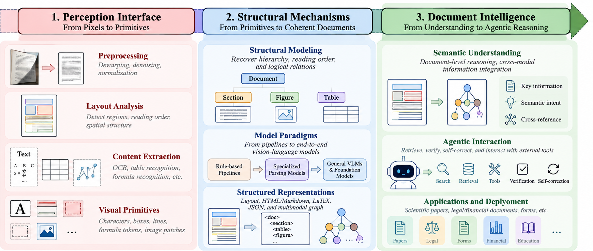
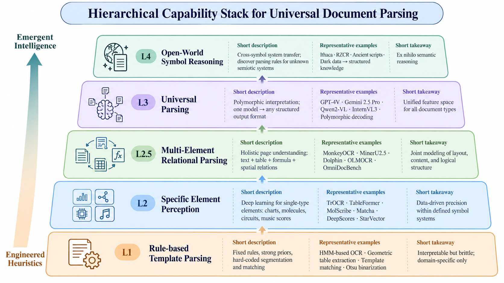
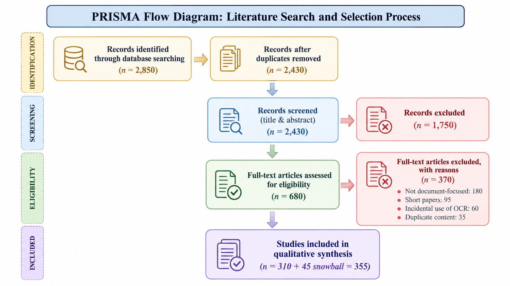
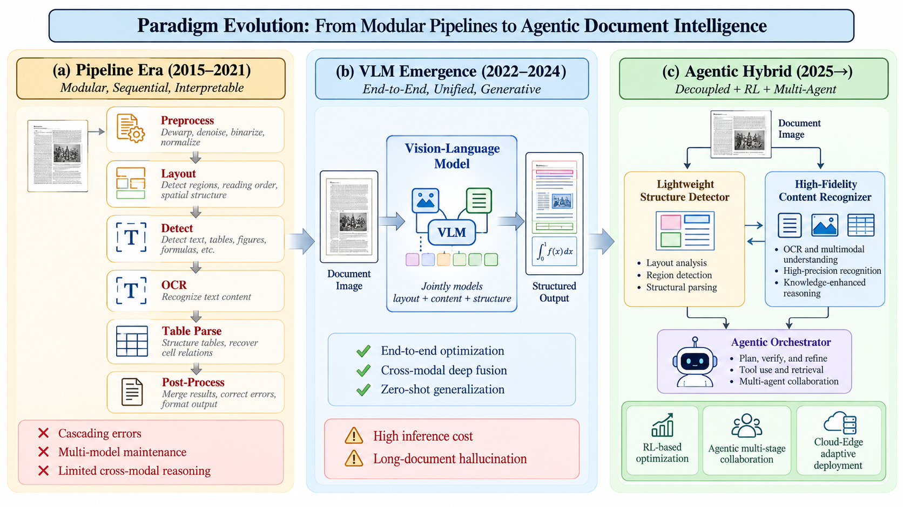
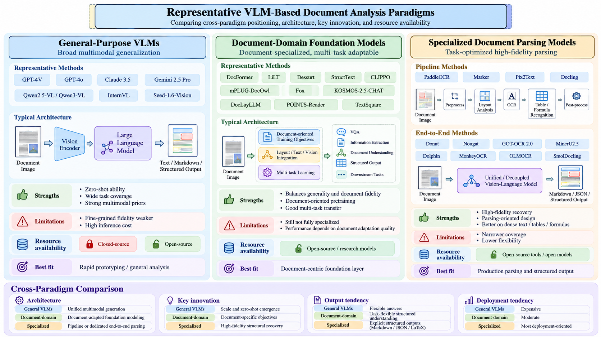
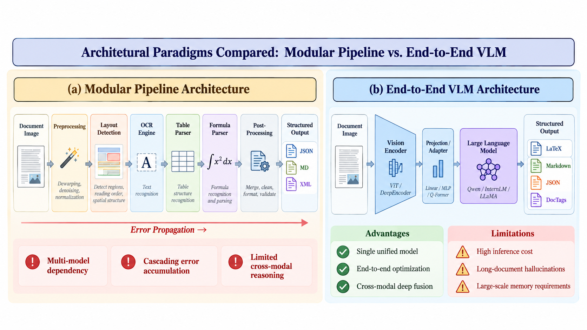
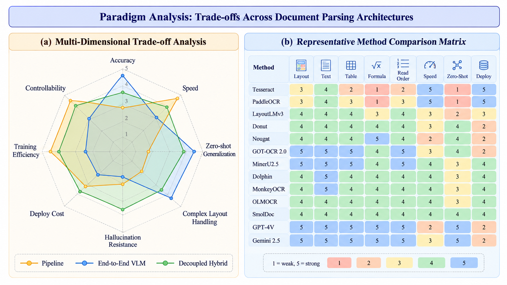
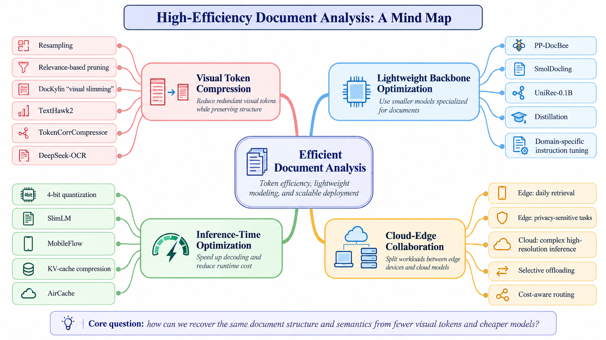
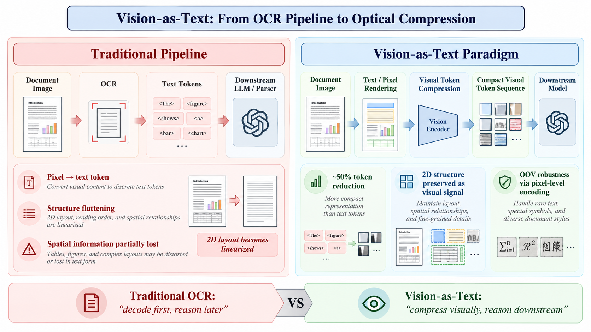
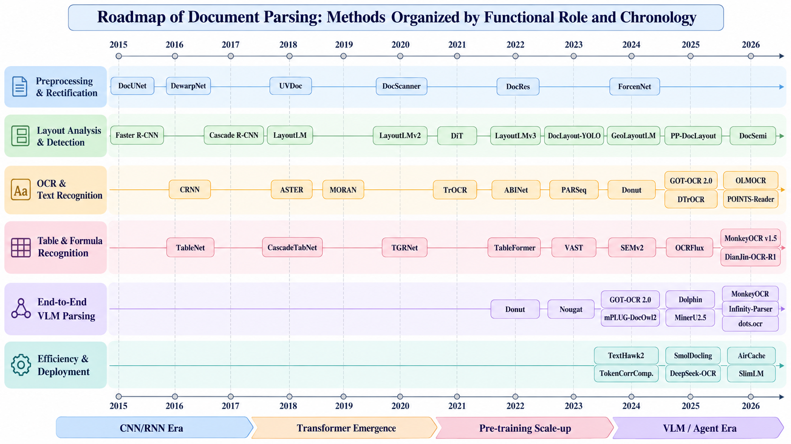

<div align="center">
  
# 🚀 Awesome Document Intelligence 📄

### From pixels to structured knowledge, grounded reasoning, and document agents

<p>
  <a href="https://github.com/gacn2890356890-rgb/awesome-document-intelligence"></a>
  <a href="https://github.com/gacn2890356890-rgb/awesome-document-intelligence"></a>
  <a href="figures/"></a>
  <a href="https://github.com/gacn2890356890-rgb/awesome-document-intelligence"></a>
</p>

<p>
  <a href="#taxonomy">Taxonomy</a> ·
  <a href="#papers">Papers</a> ·
  <a href="#datasets">Datasets</a> ·
  <a href="#evaluation">Evaluation</a> ·
  <a href="#open-source-ecosystem">Open-source ecosystem</a> ·
  <a href="#figures">Figures</a>
</p>

</div>

> A visual, source-traceable hub for document parsing, document understanding, visual document intelligence, and agentic reasoning.



This repository accompanies the survey **From Pixels to Knowledge: A Survey of Document Parsing, Understanding, and Agentic Reasoning**. Its organization is inspired by [Awesome VLA](https://github.com/yueen-ma/awesome-vla): a compact definition layer, a field taxonomy, a chronological map, curated papers, datasets, tools, related surveys, and a contribution path.

<div align="center">

**pixels** → **visual primitives** → **structural relations** → **semantic intent** → **grounded actions**

</div>

## Quick navigation

| 🧭 Explore | 📚 Evidence | 🧰 Build | 🔬 Research frontier |
| --- | --- | --- | --- |
| [Taxonomy](#taxonomy) · [Timeline](#timeline) | [Papers](#papers) · [Datasets](#datasets) | [Tools](#open-source-ecosystem) · [Evaluation](#evaluation) | [World models](#document-world-models) · [Agents](#document-world-models) |

## What is document intelligence?

Document intelligence is the end-to-end recovery and use of meaning encoded in document pixels. It joins perception, structure, semantics, retrieval, verification, and interaction instead of treating OCR as an isolated preprocessing step.

### The structured knowledge substrate

| Layer | Core question | Typical artifacts |
| --- | --- | --- |
| 🎨 **Visual primitives** | What is visible? | pixels, regions, lines, symbols, text boxes |
| 🧩 **Structural relations** | How is it organized? | reading order, hierarchy, table topology, formula syntax |
| 🧠 **Semantic intent** | What does it mean? | document roles, entities, cross-references, arguments |
| 🤖 **Grounded action** | What should the system do? | retrieval, verification, tool calls, structured answers |

## Taxonomy

### 1. Perception interface: pixels to primitives

<table>
<tr>
<td>🧹 <b>Preprocessing</b><br>dewarping · denoising · deskewing · restoration</td>
<td>🗺️ <b>Layout analysis</b><br>regions · reading order · hierarchy · geometry</td>
<td>🔤 <b>OCR and recognition</b><br>printed · handwritten · multilingual · dense text</td>
<td>∑ <b>Symbols</b><br>formulas · charts · chemistry · music · scripts</td>
</tr>
</table>

### 2. Structural mechanisms: primitives to coherent documents

- modular pipelines with explicit intermediate representations;
- multimodal pretraining over text, layout, and pixels;
- OCR-free and VLM-based structured generation;
- table, formula, chart, and cross-page relation recovery;
- decoupled hybrids that combine lightweight structure detection with high-fidelity recognition.

### 3. Semantic understanding and action

- visual question answering and information extraction;
- retrieval-augmented document analysis;
- citation grounding, verification, and self-correction;
- tool-using and multi-agent document workflows;
- stateful document world models.

### Capability ladder

```text
L4  Open-world symbol reasoning       unfamiliar symbols, rules, and semantic systems
↑
L3  Universal parsing                  one adaptable model, many document formats
↑
L2.5 Multi-element relational parsing text + table + formula + spatial relations
↑
L2  Specific-element perception       defined element families and symbols
↑
L1  Rule/template parsing              engineered priors and fixed schemas
```

## Timeline

| Period | Field movement | Anchor resources |
| --- | --- | --- |
| **2015–2019** | CNN/RNN OCR, layout detection, table structure | [CRNN](https://arxiv.org/abs/1507.05717) · [PubLayNet](https://arxiv.org/abs/1908.07836) · [TableBank](https://arxiv.org/abs/1903.01949) |
| **2020–2021** | multimodal document pretraining and document VQA | [LayoutLM](https://doi.org/10.1145/3394486.3403172) · [DocVQA](https://arxiv.org/abs/2007.00398) · [LayoutLMv2](https://aclanthology.org/2021.findings-acl.201/) |
| **2022–2023** | OCR-free generation and document foundation models | [Donut](https://arxiv.org/abs/2111.15664) · [Nougat](https://arxiv.org/abs/2308.13418) · [Pix2Struct](https://proceedings.mlr.press/v202/kantorov-23a.html) |
| **2024–2025** | general VLMs, structured parsing, efficiency, and agents | [DocLLM](https://aclanthology.org/2024.acl-long.463/) · [Docling](https://github.com/docling-project/docling) · [olmOCR](https://github.com/allenai/olmocr) |
| **2025–2026** | decoupled hybrids, visual token efficiency, interactive intelligence | [World-model guide](docs/world-models-and-agents.md) · [Evaluation guide](docs/evaluation.md) |

## Papers

The visual reading path is in [`references/papers.md`](references/papers.md). The complete manuscript bibliography is preserved in [`references/survey-references.bib`](references/survey-references.bib) with 263 entries.

<table>
<tr>
<td>📐 <b>Layout</b><br><a href="https://doi.org/10.1145/3394486.3403172">LayoutLM</a> · <a href="https://aclanthology.org/2022.acl-long.250/">LayoutLMv3</a> · <a href="https://arxiv.org/abs/2206.01062">DocLayNet</a></td>
<td>🔍 <b>OCR-free</b><br><a href="https://arxiv.org/abs/2111.15664">Donut</a> · <a href="https://arxiv.org/abs/2308.13418">Nougat</a> · <a href="https://proceedings.mlr.press/v202/kantorov-23a.html">Pix2Struct</a></td>
</tr>
<tr>
<td>📊 <b>Tables and charts</b><br><a href="https://arxiv.org/abs/1903.01949">TableBank</a> · <a href="https://arxiv.org/abs/2110.00061">PubTables-1M</a> · <a href="https://arxiv.org/abs/2203.10244">ChartQA</a></td>
<td>🤝 <b>Agents and world models</b><br><a href="https://openreview.net/forum?id=WE_vluYUL-X">ReAct</a> · <a href="https://aclanthology.org/2023.emnlp-main.507/">RAP</a> · <a href="https://arxiv.org/abs/2503.13964">mDocAgent</a></td>
</tr>
</table>

## Datasets

The full dataset map is in [`docs/datasets.md`](docs/datasets.md).

<div align="center">

| 🗺️ Layout | 🔤 OCR | 🧾 Forms | 📄 VQA | 📊 Tables/charts | 🧱 End-to-end |
| --- | --- | --- | --- | --- | --- |
| [PubLayNet](https://arxiv.org/abs/1908.07836)<br>[DocBank](https://arxiv.org/abs/2006.01038)<br>[DocLayNet](https://arxiv.org/abs/2206.01062) | [ICDAR RRC](https://rrc.cvc.uab.es/) | [FUNSD](https://guillaumejaume.github.io/FUNSD/) | [DocVQA](https://arxiv.org/abs/2007.00398)<br>[InfoVQA](https://arxiv.org/abs/2104.12723) | [TableBank](https://arxiv.org/abs/1903.01949)<br>[PubTables-1M](https://arxiv.org/abs/2110.00061)<br>[ChartQA](https://arxiv.org/abs/2203.10244) | [OmniDocBench](https://arxiv.org/abs/2412.07626) |

</div>

## Evaluation

The full protocol is in [`docs/evaluation.md`](docs/evaluation.md).

| Layer | Metrics to report | Failure it exposes |
| --- | --- | --- |
| 👁️ Perception | CER/WER · IoU · mAP · F1 | missed regions and wrong text |
| 🧬 Structure | TEDS · normalized edit distance · graph F1 · reading-order accuracy | broken tables, hierarchy, and relations |
| 🧠 Semantics | ANLS · EM/F1 · relation F1 · evidence correctness | unsupported or semantically wrong answers |
| 🔁 Agent loop | tool success · correction rate · grounded action accuracy · abstention | wrong tool choice and unverified reasoning |
| ⚡ Systems | latency · memory · tokens/page · cost/page · throughput | deployment and efficiency limits |

## Open-source ecosystem

These are public projects and implementation starting points, not endorsements. Check licenses, model cards, maintenance status, and data terms before deployment.

<div align="center">

<a href="https://github.com/docling-project/docling"></a>
<a href="https://github.com/PaddlePaddle/PaddleOCR"></a>
<a href="https://github.com/opendatalab/MinerU"></a>
<a href="https://github.com/allenai/olmocr"></a>

<br>

<a href="https://github.com/datalab-to/surya"></a>
<a href="https://github.com/datalab-to/marker"></a>
<a href="https://github.com/breezedeus/Pix2Text"></a>
<a href="https://github.com/QwenLM/Qwen2.5-VL"></a>

</div>

## Document world models

<div align="center">



</div>

The forward-looking design guide is in [`docs/world-models-and-agents.md`](docs/world-models-and-agents.md). A document world model treats a document as a typed, uncertain, stateful substrate:

```text
observe → build/update state → predict relations → choose tool → verify → act or abstain
```

## Figures

All ten figures from the submitted survey version are preserved as original raster assets. Open any thumbnail for the full-resolution image.

<table>
<tr>
<td><a href="figures/fig01-document-intelligence-overview.png"></a><br><b>Figure 1.</b> Document intelligence overview</td>
<td><a href="figures/fig02-prisma-flow.png"></a><br><b>Figure 2.</b> PRISMA flow diagram</td>
</tr>
<tr>
<td><a href="figures/fig03-paradigm-evolution.png"></a><br><b>Figure 3.</b> Paradigm evolution</td>
<td><a href="figures/fig04-vlm-paradigms.png"></a><br><b>Figure 4.</b> Representative VLM paradigms</td>
</tr>
<tr>
<td><a href="figures/fig05-pipeline-vs-e2e.png"></a><br><b>Figure 5.</b> Pipeline versus end-to-end VLM</td>
<td><a href="figures/fig06-paradigm-tradeoffs.png"></a><br><b>Figure 6.</b> Paradigm trade-offs</td>
</tr>
<tr>
<td><a href="figures/fig07-efficient-analysis.png"></a><br><b>Figure 7.</b> Efficient document analysis</td>
<td><a href="figures/fig08-vision-as-text.png"></a><br><b>Figure 8.</b> Vision-as-Text</td>
</tr>
<tr>
<td><a href="figures/fig09-technology-roadmap.png"></a><br><b>Figure 9.</b> Technology roadmap</td>
<td><a href="figures/fig10-capability-hierarchy.png"></a><br><b>Figure 10.</b> L1–L4 capability hierarchy</td>
</tr>
</table>

## Contributing

Please open a pull request with the canonical title, authors, year, stable public link, taxonomy category, resource type, license/access notes, and a one-sentence reason for inclusion. See [`CONTRIBUTING.md`](CONTRIBUTING.md).

Do not add private manuscripts, personal data, unverifiable leaderboard claims, or unsupported numbers.

## Citation

```bibtex
Work in progress; manuscript citation to be added after publication
```

The repository is independent and is not affiliated with [Awesome VLA](https://github.com/yueen-ma/awesome-vla).
